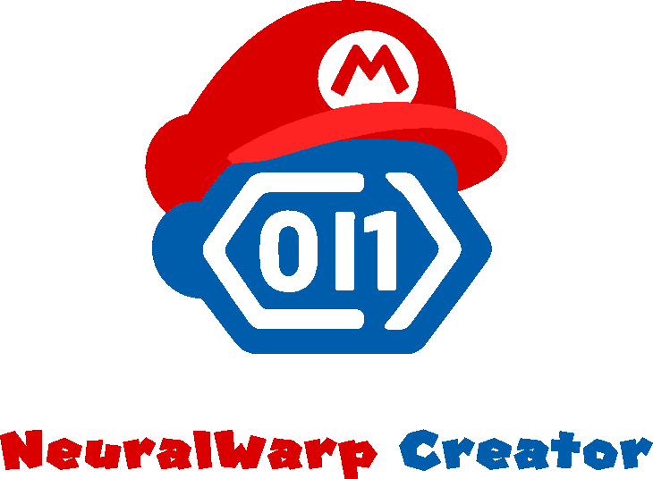

# **NeuralWarp Creator**

使用 AI 构建 SMBX 38A 关卡的项目。

## 开发须知

### 目录一览

- 开发文档:
  项目的开发文档统一存放在 `./.docs` 目录下, 其中:

  - `./.docs/.smbx38a-docs` - SMBX 38A 引擎的操作及使用文档, 以及相关文件的格式文档, 及一些杂项
    - `./.docs/.smbx38a-docs/NPC List.md` - 存放 NPC 列表, 用于查询 ID 对应的具体 NPC
  - `./.docs/.teascript-docs` - SMBX 38A 所使用脚本的开发文档, 这是一种不常见的脚本, 请参考文档进行开发
    最好在进入这些文档目录后, 优先阅读其中的 `README.md` 文件
- AI Skills:
  AI 协作能力以 skill 形式存放在 `./.ai/skills/` 下:

  - `smbx-38a` —— `.lvl/.wld/.wls` 解析/查询/编辑、TeaScript 脚本提取与回写、引擎 IPC 控制（重载/触发事件/查询状态）、窗口截图自检、SMBX/Editor 测试会话与进程管理。详见 [`.ai/skills/smbx-38a/SKILL.md`](.ai/skills/smbx-38a/SKILL.md)。
  - `teascript-helper` —— TeaScript 脚本开发助手：语法/函数速查、模板、静态 lint、嵌入到 lvl、绑定 Event→Script、一键回归（lint + inject + reload + trigger + screenshot + 让用户 review）。详见 [`.ai/skills/teascript-helper/SKILL.md`](.ai/skills/teascript-helper/SKILL.md)。
  - `teascript-helper` —— TeaScript 脚本开发助手。详见 [`.ai/skills/teascript-helper/SKILL.md`](.ai/skills/teascript-helper/SKILL.md)。
- `./AI-Example` - 存放 AI 构建的关卡成品的目录。
- `./Level-Sample` - 存放作为示例的人工制作的关卡成品的目录，可作为 AI 构建关卡的参考。
